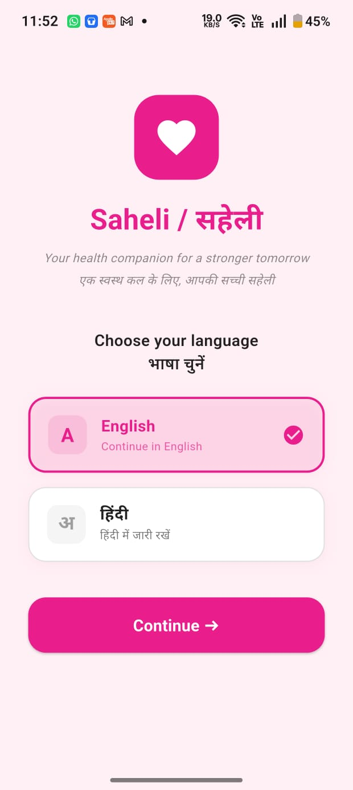
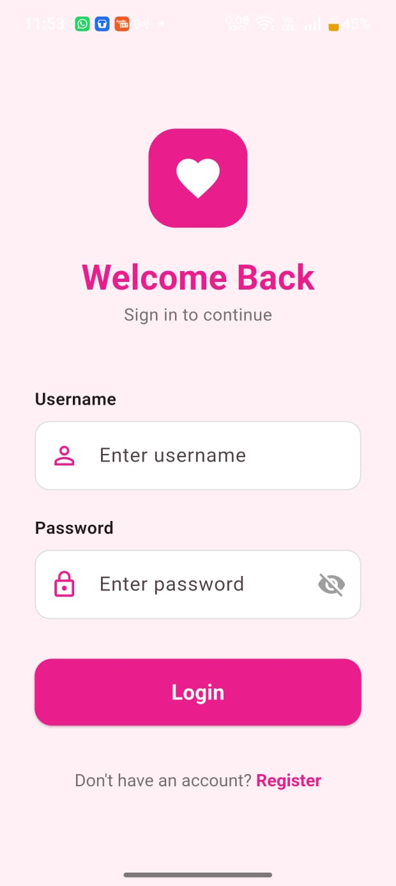
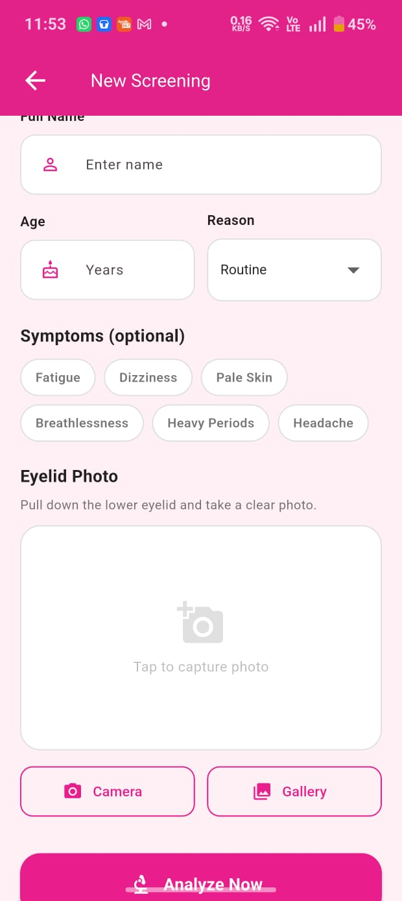
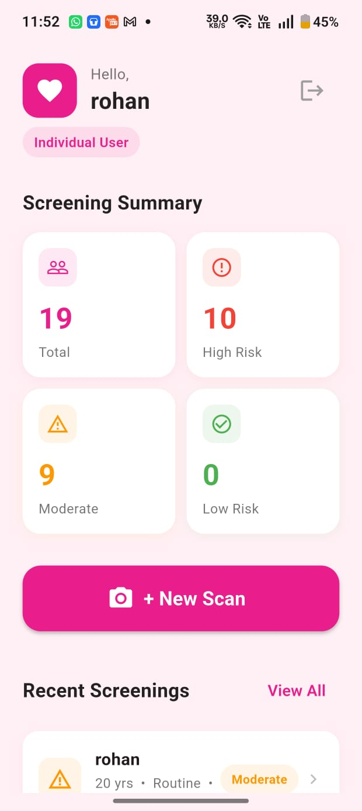
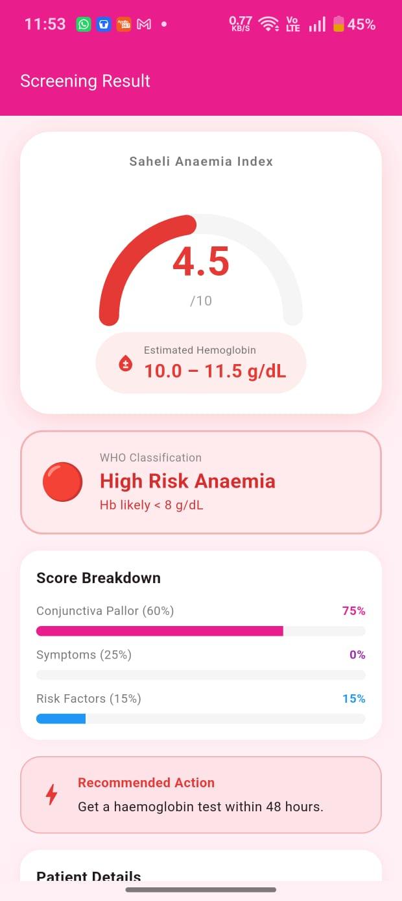
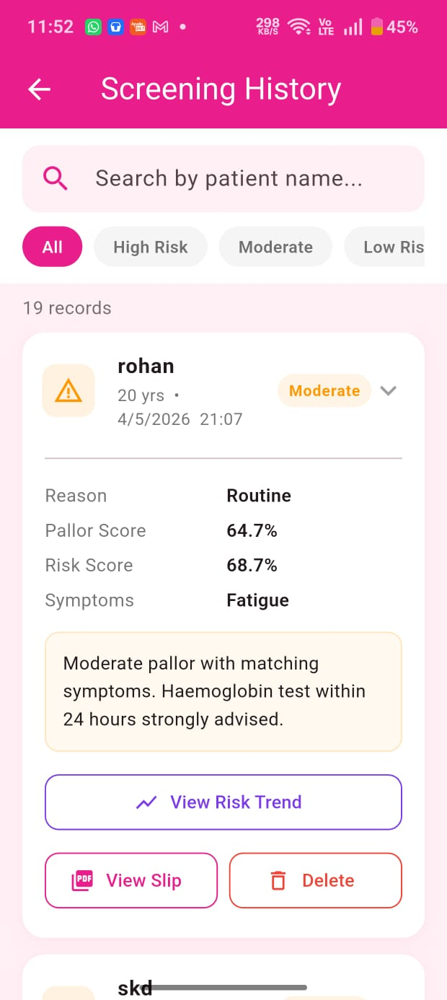
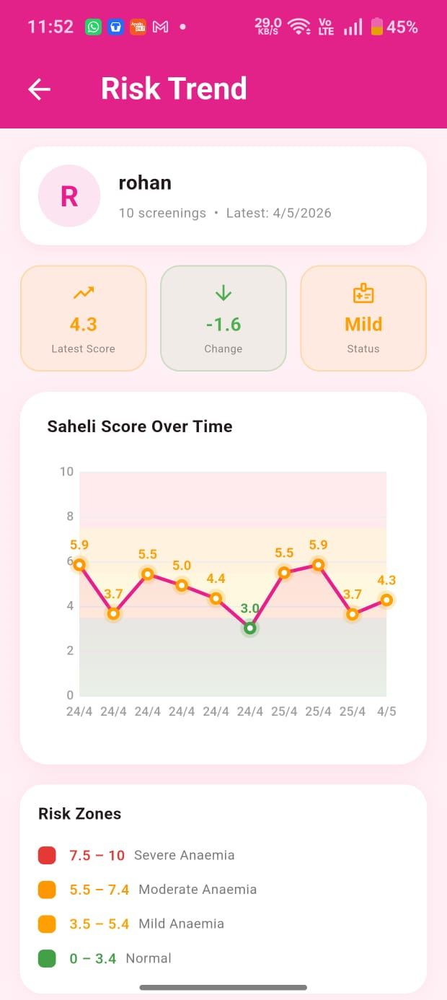
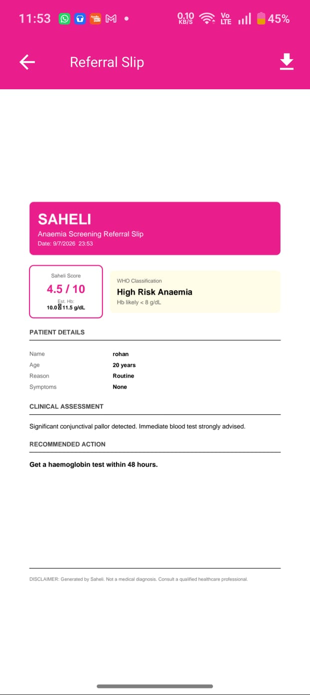

# 🌸 Saheli – AI-Powered Offline Anaemia Screening

<h3 align="center">
AI-Powered Offline Anaemia Screening using Flutter & TensorFlow Lite
</h3>

<p align="center">
A Flutter application that assists in preliminary anaemia screening through conjunctival image analysis, symptom assessment, and patient risk evaluation.
</p>

<p align="center">


</p>

---

# 📖 Overview

Anaemia is one of the most common nutritional disorders affecting women worldwide, particularly in rural and underserved communities where timely diagnosis is often unavailable.

**Saheli** is an AI-powered Flutter application developed to assist **ASHA workers** and **individual users** in performing **preliminary anaemia screening** completely offline.

The application analyses a conjunctival (lower eyelid) image using a TensorFlow Lite model, combines the prediction with symptom assessment and patient risk factors, and generates a **Saheli Anaemia Index**, estimated haemoglobin range, and risk classification. All patient records are securely stored locally using SQLite.

---

# ✨ Features

- 🤖 AI-powered conjunctival image analysis using TensorFlow Lite
- 📱 Fully offline functionality
- 🩸 Saheli Anaemia Index generation
- 📊 Estimated haemoglobin range
- 🚨 Risk classification
- 👩‍⚕️ Dual user modes
  - ASHA Worker
  - Individual User
- 📈 Patient history management
- 📉 Risk trend visualization
- 📄 PDF referral slip generation
- 🔍 Search and filter previous screenings
- 🌐 English & Hindi language support
- 💾 SQLite local database
- 🔐 Secure login and registration

---

# 🧠 AI Workflow

```text
Patient Registration
        │
        ▼
Capture / Upload Eyelid Image
        │
        ▼
Image Preprocessing
        │
        ▼
TensorFlow Lite Model
        │
        ▼
Conjunctival Pallor Score
        │
        ▼
Symptom Assessment
        │
        ▼
Risk Factor Analysis
        │
        ▼
Saheli Anaemia Index
        │
        ▼
Estimated Haemoglobin Range
        │
        ▼
Risk Classification
        │
        ▼
Patient History & Referral Slip
```

---

# 🛠 Tech Stack

| Category | Technology |
|-----------|------------|
| Mobile Development | Flutter, Dart |
| AI/ML | TensorFlow Lite, MobileNetV2 |
| Model Training | Python |
| Database | SQLite |
| Local Storage | Shared Preferences |
| Image Processing | Image Picker |
| Charts | FL Chart |
| PDF Generation | PDF Package |

---

# 📱 Application Screens

<table>
<tr>
<td align="center"><b>Language Selection</b></td>
<td align="center"><b>Login</b></td>
</tr>

<tr>
<td></td>
<td></td>
</tr>

<tr>
<td align="center"><b>Dashboard</b></td>
<td align="center"><b>New Screening</b></td>
</tr>

<tr>
<td></td>
<td></td>
</tr>

<tr>
<td align="center"><b>Screening Result</b></td>
<td align="center"><b>Patient History</b></td>
</tr>

<tr>
<td></td>
<td></td>
</tr>

<tr>
<td align="center"><b>Risk Trend</b></td>
<td align="center"><b>Referral Slip</b></td>
</tr>

<tr>
<td></td>
<td></td>
</tr>
</table>

---

# 🚀 Getting Started

## Clone the repository

```bash
git clone https://github.com/siddhi472006/saheli.git
```

## Navigate to the project

```bash
cd saheli
```

## Install dependencies

```bash
flutter pub get
```

## Run the application

```bash
flutter run
```

---

# 📂 Project Structure

```text
lib/
├── screens/
├── database_helper.dart
├── ml_service.dart
└── main.dart

assets/
├── fonts/
└── models/
    └── anaemia_model.tflite

screenshots/
```

---

# 🎯 Future Enhancements

- Clinical validation using larger datasets
- Cloud synchronization
- Doctor dashboard
- Explainable AI visualizations
- Multi-language regional support
- Integration with healthcare systems

---

# 👥 Team

- Siddhi Suryavanshi
- Rohan Goyal

---

# 📚 References

- Flutter Documentation
- TensorFlow Lite Documentation
- SQLite Documentation
- EyeDefy Anaemia Dataset (Kaggle)
- World Health Organization (WHO) Anaemia Guidelines

---

## ⚠️ Disclaimer

Saheli is intended as a **preliminary screening and decision-support application**. It is **not a diagnostic tool** and should not replace professional medical evaluation or laboratory testing.

---

## ⭐ If you found this project interesting, consider giving it a star!
